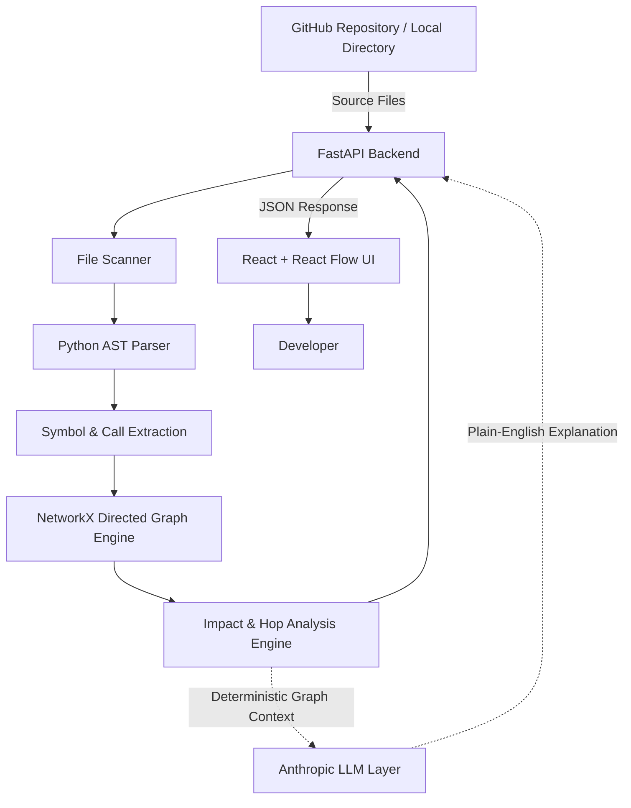

# CodeTrace AI
An interactive Python code dependency and impact analysis platform.

## Overview
When a developer modifies a function or method, determining which other parts of the codebase may be impacted is often difficult and error-prone. CodeTrace AI addresses this problem by statically analyzing Python codebases to construct an explicit dependency graph and quantify blast radius before code changes are committed.

CodeTrace AI:
- Parses Python source files safely using Python's native Abstract Syntax Tree (`ast`) module.
- Extracts function definitions, class methods, async handlers, and call expressions.
- Builds a directed dependency graph using NetworkX where nodes represent functions and edges represent call relationships.
- Calculates transitive impact using graph traversal algorithms to determine direct and indirect callers across multiple hop distances.
- Visualizes dependencies interactively in a developer-oriented IDE workspace built with React and React Flow.
- Provides AI-generated plain-English impact explanations using the Anthropic API.

## Key Features
- GitHub repository ingestion
- Python AST analysis
- Function/method dependency extraction
- Interactive dependency graph
- Direct caller and transitive impact analysis
- Hop-distance visualization
- Blast-radius analysis
- AI Impact Synthesis using Anthropic
- Graceful LLM fallback
- Syntax-error resilience
- Developer-oriented IDE interface

## Architecture


The Anthropic LLM operates as an optional secondary synthesis layer. The LLM does NOT determine dependencies; Python AST parsing and NetworkX graph algorithms are the sole source of truth for all dependency connections and impact calculations.

## Tech Stack
Frontend:
- React
- Vite
- Tailwind CSS
- React Flow
- Axios

Backend:
- Python
- FastAPI
- Pydantic
- NetworkX
- Python AST

AI:
- Anthropic API

Testing:
- Pytest

Deployment:
- Vercel
- Render

## How It Works
1. Ingestion: The user inputs a local Python project directory or a public GitHub repository URL.
2. AST Parsing: The backend scans Python files and parses source code into Abstract Syntax Trees using Python's native `ast` module.
3. Graph Construction: Function definitions, class methods, and call expressions are extracted to build a directed call graph in NetworkX.
4. Interactive Selection: The frontend renders the dependency graph and repository file tree. The developer selects a function node.
5. Impact Tracing: NetworkX computes direct callers (Hop 1) and transitive callers (Hop 2+), highlighting active dependency paths on the visual canvas.
6. AI Synthesis: The deterministic impact payload is sent to the Anthropic API, which generates a concise plain-English explanation of what breaks. If the LLM is unavailable, the system falls back gracefully while keeping deterministic impact analysis fully active.

## Impact Analysis Example
Consider a payment processing workflow with the following dependency chain:
`validate_card` -> `process_payment` -> `checkout_flow` -> `run_main`

When inspecting `validate_card`:
- Target Function: `validate_card` (the function being modified)
- Hop 1 (Direct Caller): `process_payment` directly invokes `validate_card`
- Hop 2 (Transitive Caller): `checkout_flow` calls `process_payment`
- Hop 3 (Transitive Caller): `run_main` calls `checkout_flow`

Modifying `validate_card` has a total blast radius of 3 downstream functions across 3 hop distances.

## API
- GET /health: Returns backend health status and API version.
- POST /ingest: Ingests a local directory path or GitHub repository URL, parses AST symbols, and initializes an in-memory session.
- GET /graph: Returns the JSON-serialized node and edge lists of the project dependency graph.
- GET /impact/{function_id}: Calculates direct and transitive callers for a specific function and returns deterministic impact analysis along with an AI synthesis explanation.

## Project Structure
```text
CodeTrace AI/
├── backend/
│   ├── app/
│   │   ├── api/          # FastAPI route handlers (/health, /ingest, /graph, /impact)
│   │   ├── graph/        # NetworkX graph builder, serializers, and traversal queries
│   │   ├── llm/          # Anthropic API client, prompt builders, and LLM explainer
│   │   ├── parser/       # Python AST walker and symbol/call extractor
│   │   ├── schemas/      # Pydantic data schemas for API requests and responses
│   │   ├── services/     # In-memory project session store
│   │   ├── utils/        # Repository cloner and helper utilities
│   │   ├── config.py     # Application settings and environment configurations
│   │   └── main.py       # FastAPI application entrypoint and CORS middleware
│   ├── tests/            # Backend unit test suite (pytest)
│   └── requirements.txt  # Python backend dependencies
└── frontend/
    ├── src/
    │   ├── components/   # React Flow canvas, CustomNode, TopBar, LeftRail, NodeDetailPanel, StatusBar
    │   ├── hooks/        # Custom React hooks (useGraphData)
    │   ├── utils/        # Axios API client and graph formatting utilities
    │   ├── App.jsx       # Main IDE application layout
    │   └── index.css     # Dark mode IDE styles and Tailwind configuration
    ├── package.json      # Frontend package configuration
    └── vite.config.js    # Vite bundler and API proxy settings
```

## Testing
The backend test suite is verified using `pytest`:
- 21 tests passing across AST parsing, NetworkX graph queries, FastAPI endpoints, LLM error handling, and fallback behavior.

To run the backend test suite:
```bash
cd backend
python -m pytest
```

To run the frontend production build:
```bash
cd frontend
npm run build
```

## Production
- Live Demo: https://code-trace-ai-delta.vercel.app/


## Future Improvements
- Support for additional programming languages (e.g. JavaScript/TypeScript, Go, Java via Tree-sitter).
- Improved static symbol resolution for dynamic function calls and alias imports.
- Persistent project sessions using database storage.
- User authentication and workspace access controls.
- Optimization for scaling to large enterprise repositories.

## License
MIT License
